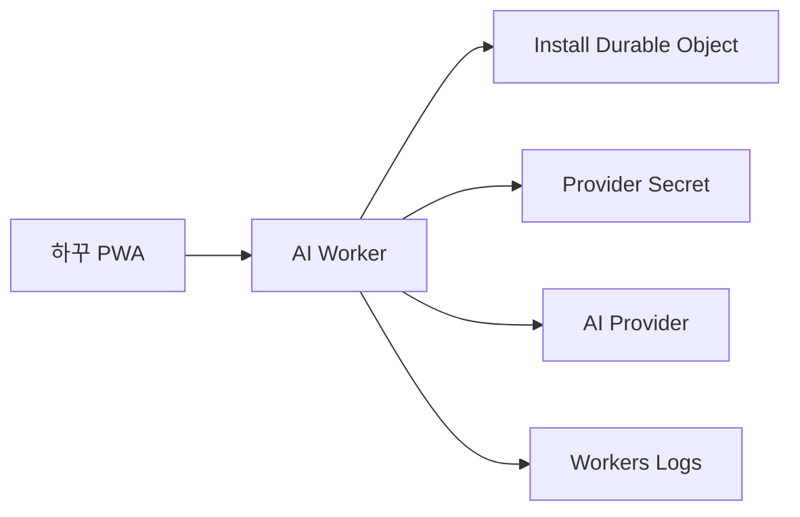

# U5 Deployment Architecture

Text alternative: The PWA sends a signed request to the dedicated AI Worker. The Worker verifies installation state and quota in a per-install Durable Object, reads the provider secret binding, calls the fixed AI provider, and writes safe operational logs.

Deployment uploads a version, runs preview contract tests, verifies required secrets, then promotes the reviewed Worker version. Production rollback deploys the prior verified version without changing the Durable Object namespace.
