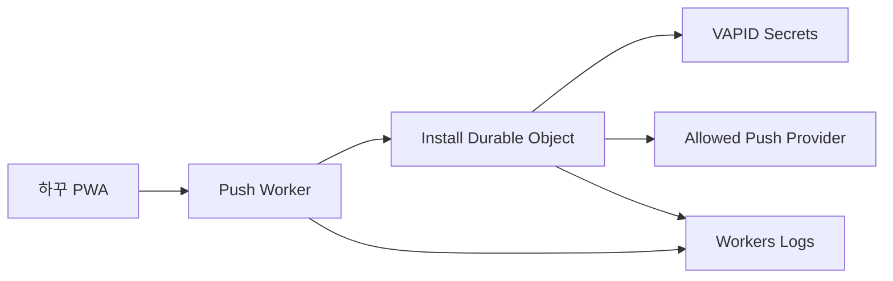

# U6 Deployment Architecture

Text alternative: The PWA sends signed subscription and schedule commands to the Push Worker. A per-install Durable Object stores ownership, schedule, subscription, and delivery keys, schedules its next alarm, reads VAPID secrets, sends only to allowed push providers, and emits safe logs.

Preview and production use separate Worker names, Durable Object namespaces, secrets, enrollment issuers, origins, and deployment credentials. Rollback keeps the namespace and promotes the prior compatible Worker version.
