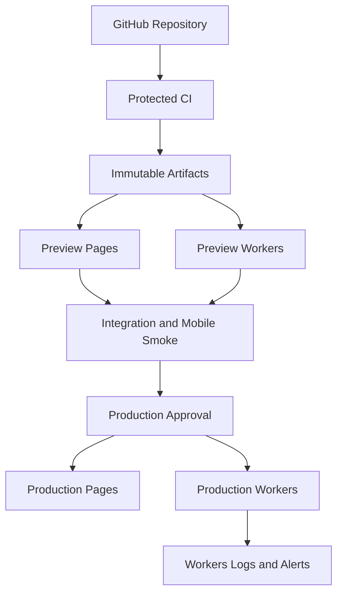

# U7 Deployment Architecture

Text alternative: Protected CI builds immutable artifacts, deploys them to isolated preview Pages and Workers, runs integration and mobile smoke checks, requires production approval, then promotes the same digests to production. Production Workers emit safe logs and alerts.

Rollback selects the previous evidence manifest and re-promotes its Pages and Worker versions, followed by health and schema-compatibility checks.
