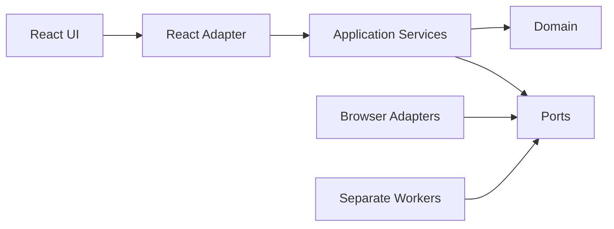

# 하꾸 Application Design

## 1. Design Outcome

하꾸는 기존 React PWA를 유지하면서 프레임워크 독립 도메인, 저장소, 애플리케이션 서비스, 플랫폼 어댑터를 점진적으로 분리한다. AI와 Push는 별도 Cloudflare Worker로 운영하고 앱·Worker 사이의 타입과 런타임 스키마만 공유한다.

이 설계는 다음 결과를 목표로 한다.

- 기록 ID와 슬롯 계산을 UI와 저장 방식에서 분리한다.
- 모든 미디어와 참조 메타데이터를 버전형 IndexedDB 경계에서 안전하게 관리한다.
- 기존 데이터는 수정하지 않고 staging migration 검증 후 활성 버전을 전환한다.
- 마감·영상·백업·복원 작업은 취소, 진행률, 실패 안전성을 가진 서비스가 조정한다.
- 브라우저에 AI 공급자 비밀키를 두지 않고 AI·Push 설치 권한을 분리한다.
- React Context는 저장소나 Worker를 직접 호출하지 않고 화면 어댑터로 축소한다.

## 2. Approved Design Decisions

| Decision | Selected Approach | Consequence |
|---|---|---|
| Module boundary | `domain`, `repositories`, `services`를 점진적으로 추가 | 전면 재작성 없이 기존 화면을 순차 이전할 수 있다. |
| Contract sharing | 공통 TypeScript 타입과 런타임 스키마 | 앱과 Worker의 계약 drift를 CI에서 차단한다. |
| Orchestration | 의존성을 주입받는 순수 TypeScript 서비스 | 브라우저 API 없이 단위·속성 테스트가 가능하다. |
| Worker topology | AI와 Push를 별도 Worker로 유지 | 비밀키, state namespace, quota, 배포 권한의 최소 권한을 유지한다. |
| Migration | legacy read-only → staging transform → validate → activate | 실패 시 기존 데이터를 그대로 유지한다. |

## 3. Architecture Style

### Lightweight Ports and Adapters

- **Domain**: 기록, 슬롯, 일정, 백업 포맷의 순수 타입과 계산
- **Application**: 사용자 흐름을 조정하는 서비스
- **Ports**: 저장소, 미디어, Crypto, AI, Push, 시계, ID 인터페이스
- **Adapters**: IndexedDB, Web APIs, React, Cloudflare Worker client
- **External Systems**: AI 공급자, Cloudflare Durable Objects, 브라우저 Push provider

### Dependency Direction



Text alternative: React UI calls a React adapter, which invokes application services. Services depend inward on pure domain types and outward-facing port interfaces. Browser and Worker adapters implement those ports. Dependencies do not point from the domain to frameworks.

## 4. Component Model

### Domain and Contracts

| Component | Responsibility |
|---|---|
| Journal Domain Model | 안정적 record, media, archive, slot ID와 session aggregate |
| Schedule Domain | 슬롯·자정·시간대·Push delivery와 멱등 키 계산 |
| Backup Domain | 매니페스트, entry, hash, 암호화 envelope, restore report |
| Runtime Contract Registry | 앱·Worker·백업의 타입과 런타임 검증 |
| Installation Identity | non-extractable 설치 키, signed request, revocation |

### Persistence

| Component | Responsibility |
|---|---|
| Journal Repository | session, record, archive, settings의 버전형 영속화 |
| Media Repository | 모든 Blob과 descriptor의 IndexedDB 저장 |
| Journal Unit of Work | 메타데이터와 미디어 커밋·보상 정리 |
| Staging Store | migration과 restore 결과의 격리·검증·활성화 |
| Migration Coordinator | legacy 읽기, 순서형 migration, 보고, 활성 버전 전환 |

### Application Services

| Component | Responsibility |
|---|---|
| Boot Orchestrator | schema 검사, migration, 초기 read model |
| Record Service | 캡처 준비, 슬롯 결정, 미디어·기록 커밋 |
| Wrap-up Service | AI 폴백, 영상 생성, archive commit, 화면 인계 |
| Video Generation Service | 기능 검사, 720×1280 profile, 진행률, 취소, 정리 |
| Backup Service | 일관 snapshot, hash, 암호화 export |
| Restore Service | 제한·해시·schema 검증, staging restore |
| AI Direction Service | 동의, 최소 데이터, signed request, output 검증, 로컬 폴백 |
| Push Service | 구독, 일정 버전, signed request, 원격 삭제 |

### Adapters and Workers

| Component | Responsibility |
|---|---|
| React App Adapter | 화면 read model, command, operation state |
| Browser Media Adapter | MediaDevices, MediaRecorder, Canvas, AudioContext lease |
| Browser Crypto Adapter | SHA-256, ECDSA, PBKDF2, AES-GCM |
| AI Worker | 설치 검증, quota, provider secret, output validation |
| Push Worker | 설치 소유권, schedule, idempotent delivery, endpoint allowlist |
| Safe Logger | 민감정보가 제거된 구조화 로그 |

세부 컴포넌트 책임은 `components.md`, 메서드 계약은 `component-methods.md`에 정의되어 있다.

## 5. Data Design

### Core Records

```typescript
interface JournalRecord {
  id: RecordId
  sessionId: string
  slotId: SlotId
  capturedAt: string
  kind: "text" | "photo" | "video" | "audio"
  text?: string
  mediaId?: MediaId
  schemaVersion: SchemaVersion
}

interface MediaDescriptor {
  id: MediaId
  mimeType: string
  bytes: number
  sha256: string
  createdAt: string
  purpose: "source" | "generated"
}

interface ArchiveEntry {
  id: ArchiveId
  sessionId: string
  recordIds: readonly RecordId[]
  generatedMediaId: MediaId
  directorMetadata: DirectorMetadata
  createdAt: string
  schemaVersion: SchemaVersion
}
```

### Storage Layout

- 하나의 버전형 IndexedDB database에 journal metadata와 media object store를 둬 가능한 변경을 같은 transaction으로 처리한다.
- `localStorage`는 활성 database 포인터, 비민감 boot preference, legacy migration source에만 제한한다.
- 설치 private key는 IndexedDB에 non-extractable `CryptoKey`로 저장한다.
- Worker는 설치 공개키, 폐기 상태, quota, subscription, schedule의 최소 데이터만 저장한다.
- AI 입력·출력 사용자 콘텐츠는 Worker 저장소에 보관하지 않는다.

### Migration Layout

1. legacy data를 읽기 전용 adapter로 연다.
2. 새 schema version의 staging database를 만든다.
3. 결정적 ID와 media reference를 생성한다.
4. schema, required fields, reference graph, 가능한 media hash를 검증한다.
5. 성공하면 active database pointer를 staging version으로 전환한다.
6. 사용자가 검증·백업하기 전에는 legacy source를 자동 삭제하지 않는다.

## 6. Application Flows

### Record

`React Screen → React Adapter → Record Service → Unit of Work → Media and Journal Repositories → IndexedDB`

화면은 transaction commit 후에만 성공 상태와 새 record를 받는다.

### Wrap-up

`Wrap-up Screen → Wrap-up Service → AI Direction or Local Fallback → Video Generation → Archive Commit → Archive Route`

Push 일정 갱신은 로컬 archive commit 이후 분리된 결과로 처리해 네트워크 오류가 생성 결과를 삭제하지 않게 한다.

### Backup and Restore

Export는 snapshot의 모든 entry를 hash하고 passphrase 기반 AEAD envelope로 보호한다. Restore는 기존 데이터와 분리된 staging database에서 envelope, schema, path, size, compression ratio, hash, reference를 검증한 뒤 활성 버전을 전환한다.

### AI

사용자 동의가 있을 때만 최소 텍스트 DTO를 설치 키로 서명해 AI Worker로 보낸다. Worker는 origin, 계약, 설치, signature, time, nonce, quota를 검사하고 공급자 결과를 허용 schema로 변환한다. 모든 실패는 로컬 방향으로 대체된다.

### Push

브라우저는 signed request로 구독과 일정 버전을 upsert한다. 설치별 Durable Object alarm은 최신 일정만 평가하고 설치·일정 버전·slot·notification kind로 만든 멱등 키가 완료되지 않은 경우에만 allowlist Push host로 전송한다.

상세 흐름과 Mermaid sequence diagram은 `component-dependency.md`에 있다.

## 7. Network Contracts

### Shared Envelope

```typescript
interface ApiEnvelope<T> {
  apiVersion: string
  requestId: string
  data: T
}

interface ApiErrorEnvelope {
  apiVersion: string
  requestId: string
  error: {
    code: string
    retryable: boolean
  }
}
```

### Signed Request Metadata

- `installationId`
- Worker별 `audience`
- HTTP method와 canonical path
- body SHA-256
- UTC timestamp와 짧은 허용 오차
- unique nonce
- ECDSA signature

각 Worker는 설치 공개키, audience, 폐기 상태, timestamp, nonce, request schema를 검증한다.

### AI Contract

AI request는 locale, user-entered text summary, 명시적으로 선택된 captions, request schema version만 포함한다. 원본 미디어와 공급자 모델 선택 권한은 클라이언트에 주지 않는다.

### Push Contract

Push schedule은 installation ID, schedule version, time zone, session bounds, interval, notification timing을 포함한다. subscription endpoint는 지원되는 HTTPS push provider host allowlist를 통과해야 한다.

## 8. Backup Contract

- 포맷은 versioned encrypted envelope와 logical manifest를 사용한다.
- 기본 암호화는 passphrase 기반 KDF와 AEAD이며 정확한 파라미터는 NFR Design에서 확정한다.
- manifest는 schema version, app build, created time, entry path, content type, bytes, SHA-256을 가진다.
- logical path는 고정 prefix와 ID만 사용하고 `..`, 절대 경로, 중복 path를 거부한다.
- reader는 entry 수, 개별·총 크기, 압축 비율, 중첩 container를 제한한다.
- 복원은 동일 ID의 conflict policy를 명시하고 반복 복원 시 중복을 만들지 않는다.

## 9. Composition and Testability

앱 시작의 composition root에서 실제 adapter를 서비스에 주입한다. 테스트는 같은 포트의 in-memory 또는 deterministic fake를 사용한다.

```typescript
interface ApplicationDependencies {
  journalRepository: JournalRepository
  mediaRepository: MediaRepository
  unitOfWork: JournalUnitOfWork
  slotCalculator: SlotCalculator
  videoEngine: VideoEnginePort
  crypto: CryptoPort
  aiClient: AIWorkerClient
  pushClient: PushWorkerClient
  clock: Clock
  ids: IdGenerator
}
```

PBT generator는 domain model과 runtime contract에 가까운 위치에 두고 예제 기반 테스트와 공유한다. browser adapter와 Worker는 계약 테스트로 공통 schema 호환성을 검증한다.

## 10. Security Baseline Compliance

| Rule | Status | Application Design |
|---|---|---|
| SECURITY-01 | Compliant | TLS, 관리형 Worker 저장, 암호화 backup envelope |
| SECURITY-02 | Compliant | Worker 접근 이벤트와 request ID |
| SECURITY-03 | Compliant | Safe Logger와 중앙 구조화 로그 |
| SECURITY-04 | Compliant | CSP·HSTS 등 필수 header를 hosting adapter 요구사항으로 정의 |
| SECURITY-05 | Compliant | Runtime Contract Registry, body·path·size 제한 |
| SECURITY-06 | Compliant | AI·Push Worker, Durable Object namespace, secret, audience 분리 |
| SECURITY-07 | N/A | VPC, subnet, firewall, network ACL 구성요소가 없다. |
| SECURITY-08 | Compliant | 설치 서명, 소유권, origin, audience 검증 |
| SECURITY-09 | Compliant | 환경 분리, safe error, 지원 runtime |
| SECURITY-10 | Compliant | 공통 계약 CI, lockfile, scan, SBOM 경계 |
| SECURITY-11 | Compliant | 계층·Worker 분리, quota와 rate limit port |
| SECURITY-12 | Compliant | non-extractable 설치 키, 관리형 provider secret, revocation |
| SECURITY-13 | Compliant | transaction, migration validation, backup hash, release version |
| SECURITY-14 | Compliant | safe metrics, alert events, retention 경계 |
| SECURITY-15 | Compliant | typed Result, staging, compensation, cleanup, local fallback |

적용 가능한 모든 Security Baseline 규칙이 컴포넌트와 서비스 경계에 반영되었으며 차단 설계 항목은 없다.

## 11. Property-Based Testing Compliance

| Rule | Status | Application Design |
|---|---|---|
| PBT-02 | Compliant | schema serialize/parse, migration, backup export/restore 왕복 포트 |
| PBT-03 | Compliant | slot, schedule, ID, migration, restore 멱등 불변성 |
| PBT-07 | Compliant | domain·contract 단위의 reusable generator 경계 |
| PBT-08 | Compliant | pure service와 fake port로 shrink·seed 재현 가능 |
| PBT-09 | Compliant | Vitest와 fast-check를 framework-independent service에 적용 |

선택된 부분 적용 규칙은 모두 테스트 가능한 인터페이스로 설계되었다. Resiliency Baseline은 비활성화되어 적용하지 않았다.

## 12. Requirement and Story Traceability

| Design Area | Requirements | Stories |
|---|---|---|
| Domain, slot, persistence | FR-001–FR-003 | US-001–US-004 |
| Wrap-up, video, archive | FR-005–FR-007 | US-005–US-007 |
| Backup and restore | FR-004 | US-008–US-009 |
| Protected AI | FR-008 | US-010 |
| Secure Push | FR-009–FR-010 | US-011–US-012 |
| Runtime, CI, operations | FR-011–FR-013 | US-013–US-017 |
| Security and privacy | NFR-001–NFR-003 | US-002–US-015, US-017 |
| Performance and compatibility | NFR-004–NFR-005 | US-003, US-007–US-009, US-011 |
| Observability and maintainability | NFR-006–NFR-007 | US-014–US-015 |
| Accessibility | NFR-008 | US-005, US-016 |

## 13. Alternatives Rejected

| Alternative | Reason Rejected |
|---|---|
| 상태 관리 라이브러리 중심 전면 재작성 | 데이터 위험과 변경량이 커지고 핵심 저장 문제를 직접 해결하지 않는다. |
| 기존 `store.ts` 확장 | 책임 집중, 테스트 어려움, transaction·migration 경계 부재가 유지된다. |
| 앱과 Worker의 독립 계약 | schema drift와 검증 누락 가능성이 높다. |
| React Context 직접 오케스트레이션 | UI 수명과 영속·외부 작업이 결합되어 실패 테스트가 어렵다. |
| AI와 Push Worker 통합 | 비밀키·state namespace·quota·배포 권한의 최소 권한을 약화한다. |
| 제자리 migration | 중간 실패 시 기존 데이터를 복구하기 어렵다. |

## 14. Deferred Detailed Decisions

다음 항목은 Application Design의 범위를 넘어 Unit별 Functional/NFR/Infrastructure Design에서 확정한다.

- IndexedDB database와 object store의 정확한 이름·인덱스
- migration step별 변환 알고리즘과 legacy media 복구 규칙
- 백업 container library, KDF iteration, chunk 크기와 압축 제한 수치
- video codec 우선순위와 bitrate 수치
- Worker rate limit, quota, timeout, nonce TTL 수치
- Cloudflare binding과 preview·production 배포 세부 구성
- 보안 header를 지원할 최종 정적 호스팅
- 경보 임계치와 로그 sink

이 항목들은 현재 컴포넌트 계약을 변경하지 않으며 차단 상태가 아니다.
