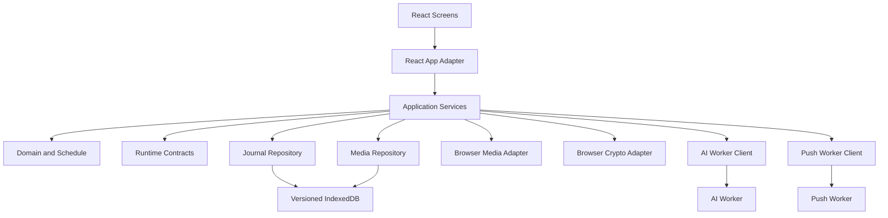
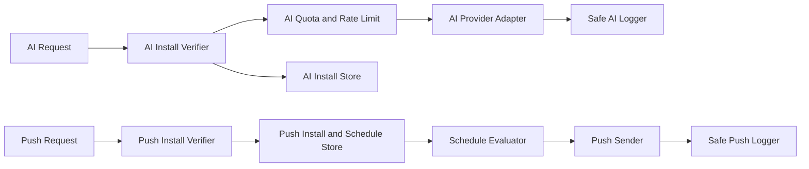
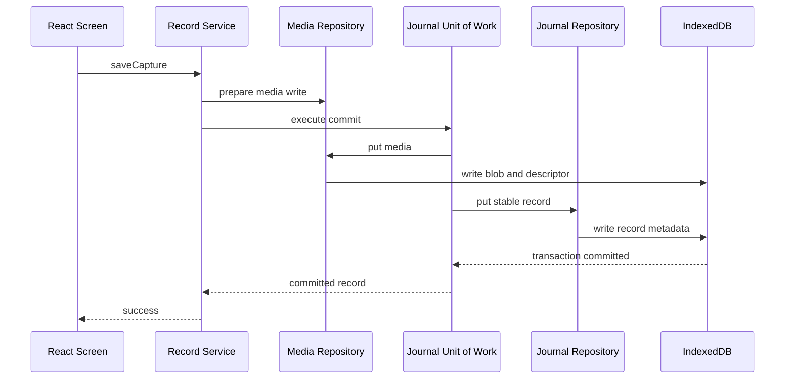
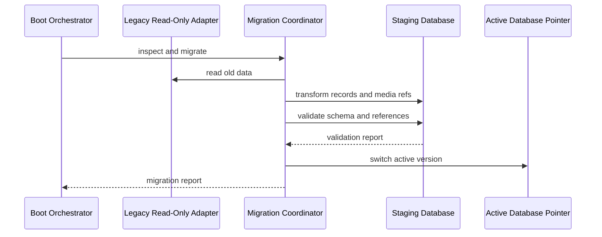
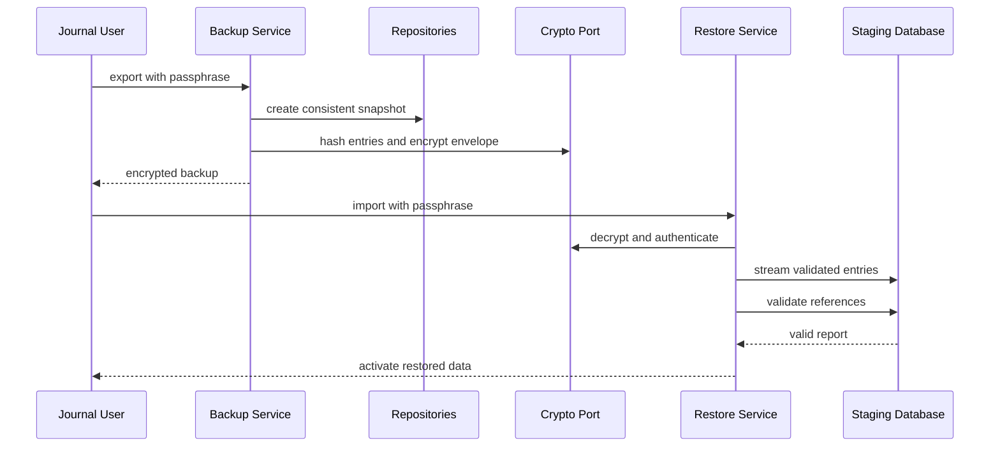
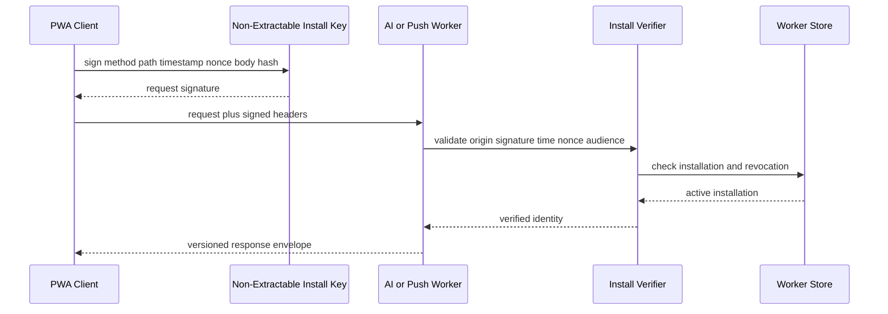

# 하꾸 Component Dependencies

## Dependency Rules

1. Domain은 React, IndexedDB, Cloudflare, Media APIs에 의존하지 않는다.
2. Application services는 포트 인터페이스에만 의존한다.
3. Browser와 Worker adapter가 포트를 구현한다.
4. React 화면은 application services와 read model만 사용한다.
5. AI Worker와 Push Worker는 배포, 비밀키, 저장소, quota를 공유하지 않는다.
6. 공통 runtime contracts는 도메인 payload와 오류 envelope만 공유하며 Worker 구현을 공유하지 않는다.

## Dependency Matrix

`Uses`는 행 컴포넌트가 열 컴포넌트의 공개 인터페이스에 의존함을 뜻한다.

| From / To | Domain | Contracts | Repositories | Media Ports | Crypto Port | AI Client | Push Client | React Adapter |
|---|---:|---:|---:|---:|---:|---:|---:|---:|
| React Screens |  |  |  |  |  |  |  | Uses |
| React Adapter | Uses |  |  |  |  |  |  |  |
| Application Services | Uses | Uses | Uses | Uses | Uses | Uses | Uses |  |
| Repository Adapters | Uses |  |  |  |  |  |  |  |
| Browser Media Adapters | Uses |  |  |  |  |  |  |  |
| Browser Crypto Adapter |  |  |  |  |  |  |  |  |
| AI Worker Client |  | Uses |  |  | Uses |  |  |  |
| Push Worker Client |  | Uses |  |  | Uses |  |  |  |
| AI Worker |  | Uses |  |  |  |  |  |  |
| Push Worker | Uses | Uses |  |  |  |  |  |  |

## Browser Component Graph

Text alternative: React screens call a React adapter, which delegates commands to application services. Services use pure domain logic, runtime contracts, repositories, browser media and crypto ports, plus AI and Push clients. Journal and media repositories share a versioned IndexedDB. Network clients call separate AI and Push Workers.

## Worker Component Graph

Text alternative: The AI Worker verifies an installation, checks its own store and quota, calls the AI provider, and emits safe logs. The Push Worker independently verifies an installation, reads its own subscription and schedule store, evaluates deliveries, sends to allowed push providers, and emits safe logs.

## Data Flow: Record Commit

Text alternative: Record Service prepares media, then uses a Unit of Work to write the Blob and stable record metadata in IndexedDB. The UI receives success only after the transaction commits.

## Data Flow: Non-Destructive Migration

Text alternative: Migration Coordinator reads legacy data without modifying it, writes transformed data to staging, validates schema and references, then switches the active database pointer only after validation.

## Data Flow: Backup and Restore

Text alternative: Export reads a consistent snapshot, hashes entries, and encrypts the container. Restore authenticates and decrypts the container, streams validated entries to staging, validates all references, and activates only a valid result.

## Data Flow: Signed Worker Request

Text alternative: The PWA signs request metadata with a non-extractable installation key. The target Worker validates origin, signature, time, nonce, audience, installation status, and revocation before handling the versioned request.

## API Communication Patterns

### AI Worker

| Operation | Pattern | Contract |
|---|---|---|
| Installation enrollment | Request-response | One-time beta credential plus public key |
| Direction generation | Signed request-response | Minimal text and selected captions |
| Installation revoke | Signed idempotent command | Installation audience and request ID |

### Push Worker

| Operation | Pattern | Contract |
|---|---|---|
| Installation enrollment | Request-response | One-time beta credential plus public key |
| Subscription upsert | Signed idempotent command | Browser subscription with supported HTTPS host |
| Schedule upsert | Signed versioned command | Time zone, interval, timing, schedule version |
| Test notification | Signed rate-limited command | Request ID |
| Installation delete | Signed idempotent command | Removes or revokes owned resources |
| Durable Object alarm | Scheduled internal command | Latest schedule and delivery idempotency key |

## Coupling Controls

- 서비스는 global singleton을 직접 import하지 않고 composition root에서 포트를 받는다.
- Worker DTO는 domain aggregate 전체를 전송하지 않는다.
- UI read model은 영속 모델과 분리해 migration 시 화면 결합을 줄인다.
- 영상 엔진은 repository를 직접 알지 않고 전달받은 media lease만 사용한다.
- backup container는 저장소 내부 key path를 노출하지 않고 논리 경로를 사용한다.
- Worker safe error code는 내부 예외 종류와 일대일 대응하지 않는다.
