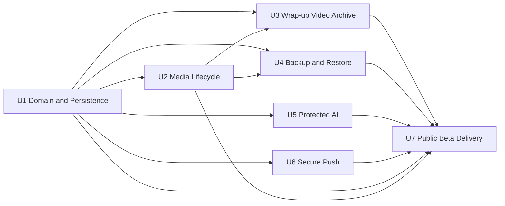

# 하꾸 Unit Dependencies

## Dependency Policy

- Unit 의존성은 공개 타입, runtime schema, repository port, build artifact로만 연결한다.
- 하위 Unit은 상위 Unit의 내부 구현을 import하지 않는다.
- cross-unit contract 변경은 provider와 모든 consumer의 계약 테스트를 함께 갱신한다.
- AI와 Push Unit은 U1 이후 서로 독립적으로 구현·배포할 수 있다.
- U7은 제품 기능을 소유하지 않고 U1–U6의 릴리스 증거를 통합한다.

## Dependency Graph

Text alternative: U1 is the foundation. U2, U5, and U6 can start after U1. U3 and U4 require U1 and U2. U7 integrates release evidence from all preceding Units. The graph is acyclic.

## Dependency Matrix

`D`는 행 Unit이 열 Unit의 완료된 계약 또는 artifact에 직접 의존함을 뜻한다.

| From / To | U1 | U2 | U3 | U4 | U5 | U6 | U7 |
|---|---:|---:|---:|---:|---:|---:|---:|
| U1 | — |  |  |  |  |  |  |
| U2 | D | — |  |  |  |  |  |
| U3 | D | D | — |  |  |  |  |
| U4 | D | D |  | — |  |  |  |
| U5 | D |  |  |  | — |  |  |
| U6 | D |  |  |  |  | — |  |
| U7 | D | D | D | D | D | D | — |

## Dependency Contracts

### U1 → U2

- Domain ID와 `MediaDescriptor`
- Journal Unit of Work와 repository transaction
- migration hook와 test generator
- typed storage error

### U1 and U2 → U3

- stable record와 archive model
- media get·put·lease·cleanup
- storage capability와 quota result
- React composition root와 operation state

### U1 and U2 → U4

- consistent snapshot
- staging store와 active pointer
- streaming media read·write
- migration runner와 runtime schema
- Crypto Port

### U1 → U5

- shared API envelope와 `RuntimeSchema<T>`
- installation identity와 signed request port
- safe error와 request ID
- build·schema version contract

### U1 → U6

- shared API envelope와 installation identity
- schedule domain과 delivery idempotency key
- time zone, slot, schedule version type
- safe error와 request ID

### U1–U6 → U7

- build와 schema version
- Unit test·PBT·contract·browser evidence
- deployable PWA와 Worker artifacts
- safe log event schema와 metrics
- security compliance evidence
- user·operator documentation inputs

## Implementation Batches

| Batch | Units | Parallelism | Exit Checkpoint |
|---|---|---|---|
| 1 | U1 | Sequential foundation | Domain, contracts, repository ports, migration and PBT approved |
| 2 | U2, U5, U6 | Parallel after U1 | Media lifecycle and both Worker contracts independently pass |
| 3 | U3, U4 | Parallel after U2 | Mobile generation and backup·restore round-trip pass |
| 4 | U7 | Final integration | Full CI, security, mobile, deployment and rollback evidence pass |

U5와 U6이 Batch 2에서 완료되지 않았더라도 U3은 local AI fallback과 Push client port fake를 사용해 개발할 수 있다. 최종 U7 진입 전에는 실제 계약 통합이 완료되어야 한다.

## Critical Path

`U1 → U2 → max(U3, U4) → U7`

AI와 Push가 critical path 밖에서 지연되지 않도록 U5와 U6은 U2와 병렬로 시작한다. U7은 U3–U6이 모두 완료될 때까지 시작할 수 있는 준비 작업과 최종 통합 작업을 분리한다.

## Integration Checkpoints

### CP1: Foundation Ready

- U1 public types와 runtime schema version 고정
- legacy migration fixture와 active pointer rollback 통과
- Slot and schedule generator가 consumer Unit에 제공됨

### CP2: Media Ready

- U2 Media Repository contract test 통과
- reference cleanup과 quota failure fixture 제공
- U3와 U4가 동일 media streaming contract를 사용함

### CP3: Browser Product Ready

- U3의 record→wrap→archive→replay 흐름 통과
- U4의 export→delete→restore hash 왕복 통과
- U5와 U6 client port fake가 실제 Worker response schema와 일치함

### CP4: Worker Ready

- U5 AI Worker auth·quota·fallback contract 통과
- U6 Push Worker auth·schedule·idempotency contract 통과
- preview 환경에서 origin, secret, Durable Object namespace 분리 확인

### CP5: Public Beta Ready

- U7 전체 CI와 공급망 검사 통과
- 실제 security header와 version 확인
- iOS·Android smoke, Worker smoke, rollback rehearsal 통과

## Rollback Boundaries

| Unit | Rollback Boundary |
|---|---|
| U1 | active database pointer를 이전 version으로 유지하고 legacy source 보존 |
| U2 | 새 media writes를 compatibility adapter 뒤에서 비활성화하고 기존 참조 유지 |
| U3 | 기존 archive를 보존하고 새 wrap path를 feature gate로 비활성화 |
| U4 | restore는 staging만 삭제하며 active data 불변 |
| U5 | client가 local direction fallback으로 전환하고 AI Worker version rollback |
| U6 | 새 schedule version을 중지하고 이전 검증 Worker version rollback |
| U7 | 직전 검증 PWA·Worker artifacts로 승격 포인터 rollback |

## Cycle Validation

Topological order 중 하나는 `U1, U2, U5, U6, U3, U4, U7`이다. 모든 직접 의존성은 이 순서에서 앞선 Unit을 가리키므로 순환 의존성이 없다.
