# 하꾸 Execution Plan

## Detailed Analysis Summary

### Transformation Scope

- **Transformation Type**: 브라우저 데이터 계층, 미디어 파이프라인, 외부 서비스 경계, 배포 체계를 함께 바꾸는 구조적 개선
- **Primary Changes**: 안정적 기록 ID와 슬롯, IndexedDB 미디어 저장소, 버전 마이그레이션, 완전 백업·복원, 모바일 영상 안정화, AI 프록시, Push 보호·멱등성, CI/CD와 관측성
- **Existing Application Packages**: React PWA와 Cloudflare Push Worker
- **New Logical Components**: 미디어 저장소, 마이그레이션 러너, 백업 서비스, AI Worker, 설치 기능 토큰, 자동 품질 게이트
- **Deployment Model Impact**: 정적 PWA와 Cloudflare Worker 구조는 유지하되, 보안 헤더를 보장하지 못하면 정적 호스팅을 변경한다.

### Change Impact Assessment

| Impact Area | Level | Detail |
|---|---|---|
| User-facing changes | High | 기록, 마감, 아카이브, 영상 생성, 백업·복원, AI 동의, 알림 UX가 변경된다. |
| Structural changes | High | 영속화, 미디어, 백업, AI, Push의 모듈 경계를 새로 정의한다. |
| Data model changes | High | 안정적 ID, 슬롯 ID, 스키마 버전, 미디어 참조, 일정 버전이 추가된다. |
| API changes | High | AI Worker가 추가되고 Push API에 인증·소유권·검증 계약이 추가된다. |
| NFR impact | High | 보안, 개인정보, 성능, 호환성, 관측성, 공급망 품질이 차단 조건이다. |
| Infrastructure impact | Medium | Cloudflare Worker·Durable Object 환경 분리, 비밀키, CI/CD, 보안 헤더 구성이 필요하다. |

### Component Relationships

| Component | Change Type | Change Reason | Priority |
|---|---|---|---|
| Domain models and `store.ts` | Major | 안정적 ID, 스키마, 일정 계산, 영속화 계약의 기반 | Critical |
| `context.tsx` | Major | 비동기·실패 전파가 가능한 상태 변경 계약 | Critical |
| Record and timeline screens | Major | 슬롯 저장, 다중 기록, 캡처 수명 관리 | Critical |
| Media repository | New | 모든 미디어의 IndexedDB 영속화와 참조 정리 | Critical |
| Migration runner | New | 기존 데이터의 멱등적 변환과 결과 보고 | Critical |
| Wrap-up and archive screens | Major | 동작하는 제어, 확정 순서, 아카이브 자동 열기 | Important |
| Video generator and scenes | Major | 720×1280 기본값, 기능 검사, 진행률, 취소 | Important |
| Backup service | New | 완전 내보내기, 해시 검증, 원자적 복원 | Critical |
| AI client and Worker | Major and New | 브라우저 비밀키 제거, 동의, 인증, 제한 | Critical |
| Push client and Worker | Major | 일정 멱등성, 인증, 검증, 남용 방지 | Critical |
| Service worker and hosting | Minor to Major | 보안 헤더, 알림 처리, 배포 환경에 따른 호스팅 결정 | Important |
| Tests and GitHub workflows | New | 회귀, 속성 기반 테스트, 공급망·배포 게이트 | Critical |
| README and operations docs | Major | 개인정보, 라이선스, 지원 범위, 롤백 절차 | Important |

### Risk Assessment

- **Risk Level**: High
- **Rollback Complexity**: Difficult. 로컬 데이터 마이그레이션은 원격 코드 롤백만으로 되돌릴 수 없다.
- **Testing Complexity**: Complex. 브라우저 저장소, 미디어 API, 시간대, Worker, 모바일 PWA를 함께 검증해야 한다.

| Risk | Mitigation |
|---|---|
| 기존 로컬 데이터 손실 | 비파괴 마이그레이션, 원본 보존, 버전형 백업, 원자적 커밋 |
| IndexedDB와 메타데이터 불일치 | 트랜잭션 경계, 참조 기반 정리, 실패 전파 |
| 모바일 영상 생성 실패 | 720×1280 기본값, 기능·용량 사전 검사, 취소와 정리 |
| AI·Push 남용 | 설치 토큰, 소유권 검증, 스키마·크기·속도 제한 |
| 중복 Push | 일정 버전과 슬롯별 멱등 키, 시간대·자정 속성 테스트 |
| 환경 간 데이터 혼용 | 미리보기·프로덕션 state namespace, 비밀키, 허용 출처 분리 |
| 공급망 또는 배포 회귀 | 잠금 파일, 고정 CI 액션, 스캔, 보호 브랜치, 롤백 |

## Workflow Visualization

```mermaid
flowchart TD
    Start(["Approved User Stories"])

    subgraph INCEPTION["INCEPTION"]
        WD["Workspace Detection<br/>COMPLETED"]
        RE["Reverse Engineering<br/>COMPLETED"]
        RA["Requirements Analysis<br/>COMPLETED"]
        US["User Stories<br/>COMPLETED"]
        WP["Workflow Planning<br/>COMPLETED"]
        AD["Application Design<br/>EXECUTE"]
        UG["Units Generation<br/>EXECUTE"]
    end

    subgraph CONSTRUCTION["CONSTRUCTION"]
        FD["Functional Design<br/>EXECUTE PER UNIT"]
        NFRA["NFR Requirements<br/>EXECUTE PER UNIT"]
        NFRD["NFR Design<br/>EXECUTE PER UNIT"]
        ID["Infrastructure Design<br/>SELECTIVE EXECUTE"]
        CG["Code Generation<br/>ALWAYS EXECUTE"]
        More{"More Units?"}
        BT["Build and Test<br/>ALWAYS EXECUTE"]
    end

    subgraph OPERATIONS["OPERATIONS"]
        OPS["Operations<br/>PLACEHOLDER"]
    end

    Start --> WD
    WD --> RE
    RE --> RA
    RA --> US
    US --> WP
    WP --> AD
    AD --> UG
    UG --> FD
    FD --> NFRA
    NFRA --> NFRD
    NFRD --> ID
    ID --> CG
    CG --> More
    More -->|Yes| FD
    More -->|No| BT
    BT -. Future .-> OPS
    BT --> End(["Verified Public Beta Build"])

    style Start fill:#CE93D8,stroke:#6A1B9A,stroke-width:3px,color:#000
    style End fill:#CE93D8,stroke:#6A1B9A,stroke-width:3px,color:#000
    style WD fill:#4CAF50,stroke:#1B5E20,stroke-width:3px,color:#fff
    style RE fill:#4CAF50,stroke:#1B5E20,stroke-width:3px,color:#fff
    style RA fill:#4CAF50,stroke:#1B5E20,stroke-width:3px,color:#fff
    style US fill:#4CAF50,stroke:#1B5E20,stroke-width:3px,color:#fff
    style WP fill:#4CAF50,stroke:#1B5E20,stroke-width:3px,color:#fff
    style AD fill:#FFA726,stroke:#E65100,stroke-width:3px,stroke-dasharray:5 5,color:#000
    style UG fill:#FFA726,stroke:#E65100,stroke-width:3px,stroke-dasharray:5 5,color:#000
    style FD fill:#FFA726,stroke:#E65100,stroke-width:3px,stroke-dasharray:5 5,color:#000
    style NFRA fill:#FFA726,stroke:#E65100,stroke-width:3px,stroke-dasharray:5 5,color:#000
    style NFRD fill:#FFA726,stroke:#E65100,stroke-width:3px,stroke-dasharray:5 5,color:#000
    style ID fill:#FFA726,stroke:#E65100,stroke-width:3px,stroke-dasharray:5 5,color:#000
    style CG fill:#4CAF50,stroke:#1B5E20,stroke-width:3px,color:#fff
    style BT fill:#4CAF50,stroke:#1B5E20,stroke-width:3px,color:#fff
    style OPS fill:#BDBDBD,stroke:#424242,stroke-width:2px,stroke-dasharray:5 5,color:#000
    linkStyle default stroke:#333,stroke-width:2px
```

### Text Alternative

1. 완료된 Workspace Detection, Reverse Engineering, Requirements Analysis, User Stories를 기반으로 Workflow Planning을 완료한다.
2. Application Design에서 새 구성요소와 계약을 정의한다.
3. Units Generation에서 종속성이 있는 구현 단위와 순서를 확정한다.
4. 각 Unit에 대해 Functional Design, NFR Requirements, NFR Design을 수행한다.
5. Worker, 호스팅, CI/CD가 포함된 Unit에만 Infrastructure Design을 수행한다.
6. 승인된 Code Generation 계획에 따라 Unit별 구현을 완료한다.
7. 모든 Unit이 끝나면 통합 Build and Test를 실행한다.
8. Operations는 현재 AI-DLC의 향후 확장용 placeholder다.

## Phases to Execute

### INCEPTION

- [x] Workspace Detection - COMPLETED
- [x] Reverse Engineering - COMPLETED
- [x] Requirements Analysis - COMPLETED
- [x] User Stories - COMPLETED
- [x] Workflow Planning - COMPLETED
- [ ] Application Design - EXECUTE
  - **Depth**: Comprehensive
  - **Rationale**: 새 미디어 저장소, 백업 서비스, AI Worker, 인증 경계와 컴포넌트 계약이 필요하다.
- [ ] Units Generation - EXECUTE
  - **Depth**: Comprehensive
  - **Rationale**: 데이터 모델, API, 알고리즘, 상태, Worker, 배포 파일이 여러 단위로 변경된다.

### CONSTRUCTION

- [ ] Functional Design - EXECUTE PER UNIT
  - **Depth**: Comprehensive for data, schedule, backup, media units; standard for operational units
  - **Rationale**: 마이그레이션, 원자 저장, 일정, 백업과 미디어 수명 규칙을 상세히 정의해야 한다.
- [ ] NFR Requirements - EXECUTE PER UNIT
  - **Depth**: Comprehensive
  - **Rationale**: 보안, 개인정보, 성능, 호환성, 관측성이 공개 베타 차단 조건이다.
- [ ] NFR Design - EXECUTE PER UNIT
  - **Depth**: Comprehensive
  - **Rationale**: Security Baseline과 선택된 Property-Based Testing 규칙을 설계에 구체화해야 한다.
- [ ] Infrastructure Design - SELECTIVE EXECUTE
  - **Depth**: Comprehensive for AI, Push, beta delivery; skip for browser-only units
  - **Rationale**: Cloudflare Worker·Durable Object·비밀키·호스팅·CI/CD·경보 구성이 필요한 Unit에만 가치가 있다.
- [ ] Code Generation - ALWAYS EXECUTE PER UNIT
  - **Depth**: Comprehensive
  - **Rationale**: 승인된 설계와 계획에 따른 코드, 테스트, 문서 구현이 필요하다.
- [ ] Build and Test - ALWAYS EXECUTE
  - **Depth**: Comprehensive
  - **Rationale**: 단위, 계약, 통합, 브라우저, 모바일, 보안, 성능 검증을 통합해야 한다.

### OPERATIONS

- [ ] Operations - PLACEHOLDER
  - **Rationale**: 현재 AI-DLC에서는 별도 실행 단계가 아니며 필요한 배포·관측 작업은 Infrastructure Design과 Build and Test에 포함한다.

## Proposed Unit Boundaries

최종 Unit 이름과 범위는 Units Generation에서 확정한다.

| Order | Proposed Unit | Primary Scope | Depends On |
|---|---|---|---|
| 1 | Domain and Persistence Foundation | 모델, 안정적 ID, 슬롯 계산, 저장 계약, 스키마 버전, 마이그레이션 | None |
| 2 | Media Lifecycle | IndexedDB 미디어 저장소, 캡처 제한, 참조 정리, 용량 오류 | Unit 1 |
| 3 | Wrap-up, Video, and Archive | 동작하는 마감 UI, 720×1280 생성, 진행률·취소, 아카이브 인계 | Units 1–2 |
| 4 | Backup and Restore | 버전형 컨테이너, 해시, 내보내기, 검증, 원자 복원 | Units 1–2 |
| 5 | Protected AI | 동의 UX, AI client, Cloudflare Worker, 토큰·제한·폴백 | Unit 1 |
| 6 | Secure Push | 일정 불변성, 멱등 키, 인증·검증, Worker·Durable Object, 서비스 워커 | Unit 1 |
| 7 | Public Beta Delivery | 보안 헤더, CI/CD, PBT, 관측성, 문서, 접근성 릴리스 게이트 | Units 1–6 |

## Module Update Strategy

- **Update Approach**: Hybrid. 기반 Unit은 순차 실행하고 AI와 Push는 기반 완료 후 병렬 가능하다.
- **Critical Path**: Domain and Persistence → Media Lifecycle → Wrap-up/Video and Backup/Restore → Public Beta Delivery
- **Parallelization Opportunities**: Protected AI와 Secure Push는 Unit 1 계약이 안정화된 뒤 서로 독립적으로 진행할 수 있다.
- **Coordination Points**: 도메인 타입, 설치 ID·토큰, Worker 오류 계약, 빌드·스키마 버전, 환경별 허용 출처

### Testing Checkpoints

1. Unit 1 후 슬롯·자정·마이그레이션 단위 및 속성 테스트
2. Unit 2 후 저장 실패·용량·고아 Blob 통합 테스트
3. Units 3–4 후 iOS·Android 생성 스모크와 백업·복원 해시 왕복
4. Units 5–6 후 Worker 계약·인증·속도 제한·시간대 테스트
5. Unit 7 후 전체 사용자 여정, 보안 헤더, CI/CD와 롤백 리허설

### Rollback Strategy

- 데이터 스키마 변경 전 자동 로컬 백업과 원본 보존을 제공한다.
- 마이그레이션은 새 버전 커밋 전까지 기존 저장소를 활성 상태로 유지한다.
- Worker 배포는 미리보기 환경에서 계약 테스트 후 프로덕션으로 승격한다.
- 호환 가능한 클라이언트·Worker 계약을 유지해 단계별 배포가 가능하게 한다.
- 배포물에 빌드·스키마 버전을 기록하고 직전 검증 버전으로 롤백한다.

## Estimated Effort

- **Planned Execution Stages**: Application Design, Units Generation, four adaptive per-unit design stages, Code Generation, Build and Test
- **Planning Estimate**: 숙련 개발자 1명 기준 약 6–10 집중 개발 주
- **Uncertainty**: iOS 미디어 API, 기존 사용자 데이터 형태, Cloudflare 계정·호스팅 권한에 따라 달라진다.
- **Re-estimation Point**: Application Design과 Units Generation 승인 후 Unit별로 다시 산정한다.

## Success Criteria

- 기존 데이터 마이그레이션과 완전 백업·복원 왕복이 데이터 손실 없이 통과한다.
- 대표 iOS와 Android PWA에서 기록→마감→아카이브→재생을 완료한다.
- AI와 Push Worker가 인증, 입력 검증, 소유권, 속도 제한, 안전한 로그를 적용한다.
- Push 일정이 자정·시간대·재시도 조건에서 중복 없이 동작한다.
- CI가 타입, 경고 0개 린트, 예제·속성·Worker·백업·브라우저 테스트, 빌드, 보안 검사를 통과한다.
- 프로덕션 배포와 롤백이 보호된 자동화 경로에서 재현된다.

## Extension Compliance Summary

### Security Baseline

| Rule | Status | Planning Decision |
|---|---|---|
| SECURITY-01 | Compliant | TLS, 관리형 저장 암호화, Infrastructure·NFR Design 포함 |
| SECURITY-02 | Compliant | Worker 접근 로그와 배포 검증 포함 |
| SECURITY-03 | Compliant | 구조화·중앙 로그와 민감정보 제거 포함 |
| SECURITY-04 | Compliant | 보안 헤더 검증과 필요 시 호스팅 변경 포함 |
| SECURITY-05 | Compliant | Worker·백업·미디어 입력 검증 포함 |
| SECURITY-06 | Compliant | 환경·Worker별 최소 권한 설계 포함 |
| SECURITY-07 | N/A | VPC, subnet, firewall, network ACL을 사용하는 구성요소가 없다. |
| SECURITY-08 | Compliant | 설치 토큰, 소유권, 명시적 CORS 설계 포함 |
| SECURITY-09 | Compliant | 환경 분리, 안전한 오류, 지원 런타임 포함 |
| SECURITY-10 | Compliant | 잠금 파일, 스캔, SBOM, 고정 CI 액션 포함 |
| SECURITY-11 | Compliant | 계층 분리, 속도·사용량 제한 포함 |
| SECURITY-12 | Compliant | 관리형 비밀키와 회수 가능한 토큰 포함 |
| SECURITY-13 | Compliant | 백업 해시, 마이그레이션, 추적 가능한 릴리스 포함 |
| SECURITY-14 | Compliant | 경보, 지표, 90일 보관 목표 포함 |
| SECURITY-15 | Compliant | 원자적 실패, 자원 정리, 안전한 오류 포함 |

적용 가능한 Security Baseline 규칙은 모두 실행 단계와 Unit에 연결되었으며 차단 항목은 없다.

### Property-Based Testing

| Rule | Status | Planning Decision |
|---|---|---|
| PBT-02 | Compliant | 마이그레이션과 백업·복원 왕복 테스트 |
| PBT-03 | Compliant | ID, 슬롯, 일정, 멱등성 불변성 |
| PBT-07 | Compliant | 도메인·일정·백업 생성기 |
| PBT-08 | Compliant | 축소 입력과 seed를 CI에 보존 |
| PBT-09 | Compliant | Vitest와 fast-check를 품질 게이트에 포함 |

선택한 부분 적용 범위의 모든 차단 규칙이 실행 계획에 포함되었다. Resiliency Baseline은 비활성화되어 계획에서 제외했다.
