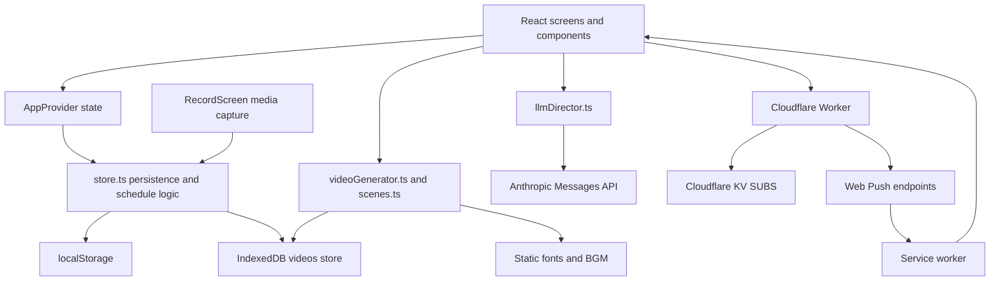
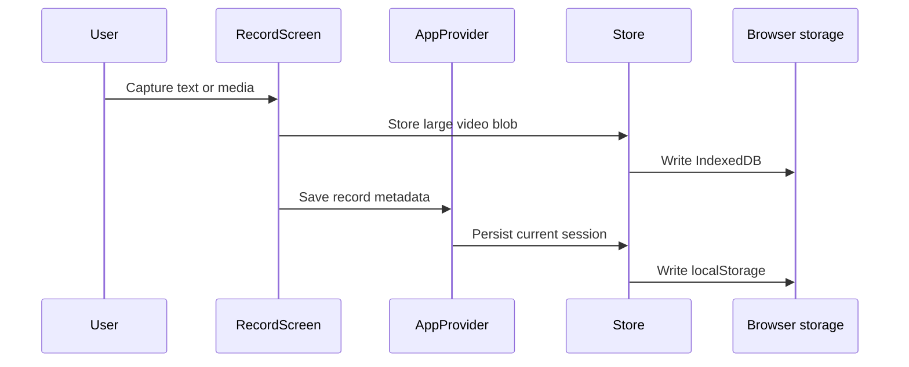
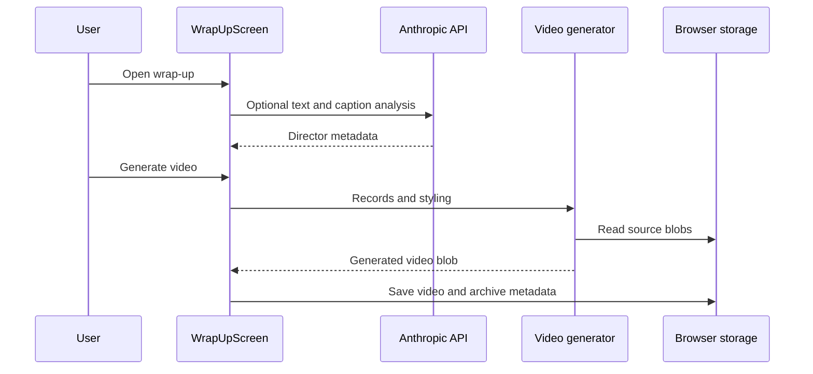
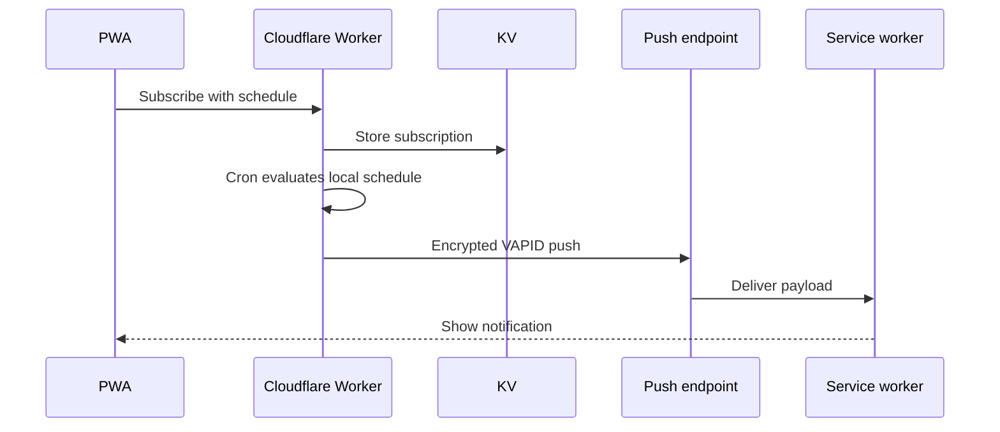

# System Architecture

## System Overview

MYHOUR is a static React 19 PWA hosted under GitHub Pages at `/myhour/`. It has no primary application server or user account system. The browser owns application state, media capture, media rendering, and persistence. Two optional network integrations exist: Anthropic Messages API for narrative direction and a Cloudflare Worker with KV for push subscriptions.

## Architecture Diagram

Text alternative: React screens share state through AppProvider. Store utilities persist metadata to localStorage and blobs to IndexedDB. Capture and generation use browser media APIs. The AI director calls Anthropic directly. Push settings call a Cloudflare Worker, which stores subscriptions in KV and sends encrypted notifications to browser push providers; the service worker displays them.

## Component Descriptions

### `myhour/src/screens`

- **Purpose**: Feature-level UI.
- **Responsibilities**: Home, today, recording, wrap-up, archive, and settings workflows.
- **Dependencies**: App context, store utilities, media generator, AI director, push client.
- **Type**: Application.

### `myhour/src/context.tsx`

- **Purpose**: In-memory application state facade.
- **Responsibilities**: Load, mutate, and persist current-session records and settings.
- **Dependencies**: `store.ts`.
- **Type**: Shared application state.

### `myhour/src/store.ts`

- **Purpose**: Domain models, schedule calculations, localStorage, IndexedDB, and archive retention.
- **Responsibilities**: Record/settings/archive persistence and day/slot utilities.
- **Dependencies**: Browser storage APIs.
- **Type**: Shared model and persistence.

### `myhour/src/videoGenerator.ts` and `myhour/src/scenes.ts`

- **Purpose**: Browser-side recap rendering.
- **Responsibilities**: Canvas scene drawing, media decoding, audio mixing, timing, MediaRecorder output.
- **Dependencies**: Canvas, AudioContext, MediaRecorder, IndexedDB, static BGM/font assets.
- **Type**: Application media subsystem.

### `myhour/src/llmDirector.ts`

- **Purpose**: Optional AI-generated recap direction.
- **Responsibilities**: Persist the API key, build a prompt, call Anthropic, parse JSON-like output.
- **Dependencies**: Anthropic Messages API and localStorage.
- **Type**: External API client.

### `myhour/src/push.ts`

- **Purpose**: Browser-side push subscription lifecycle.
- **Responsibilities**: Feature detection, permission request, subscribe, test, unsubscribe.
- **Dependencies**: Service worker, PushManager, Cloudflare Worker.
- **Type**: External service client.

### `myhour/push-server/worker.js`

- **Purpose**: Serverless push delivery.
- **Responsibilities**: Subscription storage, Web Push encryption, VAPID signing, test messages, scheduled messages.
- **Dependencies**: Cloudflare Workers runtime, KV, browser push endpoints.
- **Type**: Infrastructure application.

### `myhour/public/sw.js`

- **Purpose**: PWA runtime and notification handler.
- **Responsibilities**: App-shell navigation fallback, cache versioning, push display, notification click handling.
- **Dependencies**: Cache Storage, service worker clients API.
- **Type**: PWA infrastructure.

## Data Flow

### Capture and Archive

Text alternative: A capture screen stores a large video blob in IndexedDB, then sends record metadata to AppProvider, which persists the current session in localStorage.

### Wrap-up and Video Generation

Text alternative: Wrap-up optionally gets director metadata from Anthropic, invokes the browser video generator, reads source media from storage, and stores the generated video plus archive metadata.

### Scheduled Push

Text alternative: The PWA registers a subscription and schedule with the Worker. A cron reads subscriptions from KV, sends encrypted pushes through each push endpoint, and the service worker displays notifications.

## Integration Points

- **Anthropic Messages API**: Direct browser request from `llmDirector.ts`.
- **Cloudflare Worker**: `/health`, `/subscribe`, `/unsubscribe`, and `/test`.
- **Cloudflare KV**: `SUBS` namespace for push subscriptions and schedules.
- **Web Push Providers**: Browser-specific subscription endpoints.
- **GitHub Pages**: Static application hosting under `/myhour/`.

## Infrastructure Components

- **Static Hosting**: GitHub Pages, currently without a checked-in deployment workflow.
- **Serverless Compute**: Cloudflare Worker declared by `wrangler.toml`.
- **Data Store**: Cloudflare KV for push subscriptions.
- **Networking**: Public HTTPS endpoints; CORS allows `https://sage0316.github.io`.

