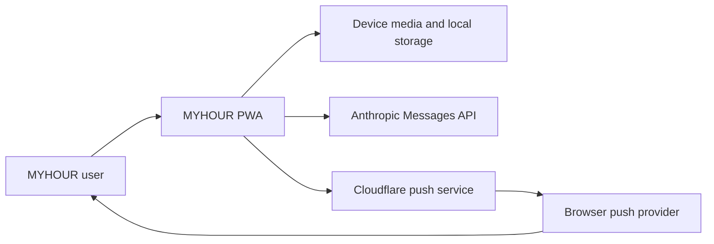

# Business Overview

## Business Context Diagram

Text alternative: A user interacts with the MYHOUR PWA. The PWA captures media and stores it locally, optionally calls Anthropic for day-summary direction, and optionally registers with a Cloudflare Worker that sends Web Push notifications.

## Business Description

- **Business Description**: MYHOUR is a mobile-first personal journaling PWA that prompts users to capture moments throughout a day and turns those moments into a short vertical recap video.
- **Primary Value**: Make daily reflection lightweight by combining scheduled prompts, multimodal capture, automatic montage generation, and a local archive.
- **Privacy Model**: Records and generated videos are primarily device-local. Text and captions are sent to Anthropic only when the user configures an API key and requests AI analysis.

## Business Transactions

1. **Configure a day** - Choose start/end times, capture interval, default record type, output preferences, and notifications.
2. **Capture a moment** - Save text, photo, video, or audio with an optional caption.
3. **Review today's moments** - Browse records by time and remove unwanted records.
4. **Direct the day** - Optionally send record metadata and text to Anthropic to produce a title, closing sentence, mood, emojis, captions, and BGM category.
5. **Generate a recap** - Render records, audio, video clips, text, images, and BGM into a vertical video in the browser.
6. **Archive a day** - Store the day's metadata and generated video locally and clean up source media according to retention rules.
7. **Manage history** - Browse, play, download, regenerate, or delete archived days.
8. **Back up current data** - Export or import current-session data and settings as JSON.
9. **Receive reminders** - Register a Web Push subscription and receive scheduled recording prompts.

## Business Dictionary

- **Record**: One captured text, photo, video, or audio moment.
- **Slot**: A configured prompt time in the user's daily schedule.
- **Session Date**: The logical day beginning at the configured start time; times before that start belong to the previous session.
- **Wrap-up**: The process that summarizes a session, optionally generates a video, and moves it into the archive.
- **Director Output**: Optional Anthropic-generated metadata used to style and caption a recap.
- **Archive Entry**: A completed or skipped-video session stored in the local archive.

## Component-Level Business Descriptions

### React PWA

- **Purpose**: Delivers capture, review, wrap-up, archive, settings, and PWA installation experiences.
- **Responsibilities**: UI state, user interactions, local persistence orchestration, and media-generation initiation.

### Local Persistence

- **Purpose**: Keep private journal data on the user's device.
- **Responsibilities**: Store settings and metadata in localStorage; store larger video blobs in IndexedDB.

### Media Pipeline

- **Purpose**: Convert daily moments into a shareable recap.
- **Responsibilities**: Capture media, draw Canvas scenes, mix audio, record output, and manage source/generated blobs.

### AI Director

- **Purpose**: Enrich a recap with narrative and stylistic metadata.
- **Responsibilities**: Build a day prompt, call Anthropic, parse structured output, and apply fallbacks.

### Push Worker

- **Purpose**: Remind users to record at configured times.
- **Responsibilities**: Store subscriptions, encrypt Web Push payloads, sign VAPID requests, schedule delivery, and remove expired subscriptions.

