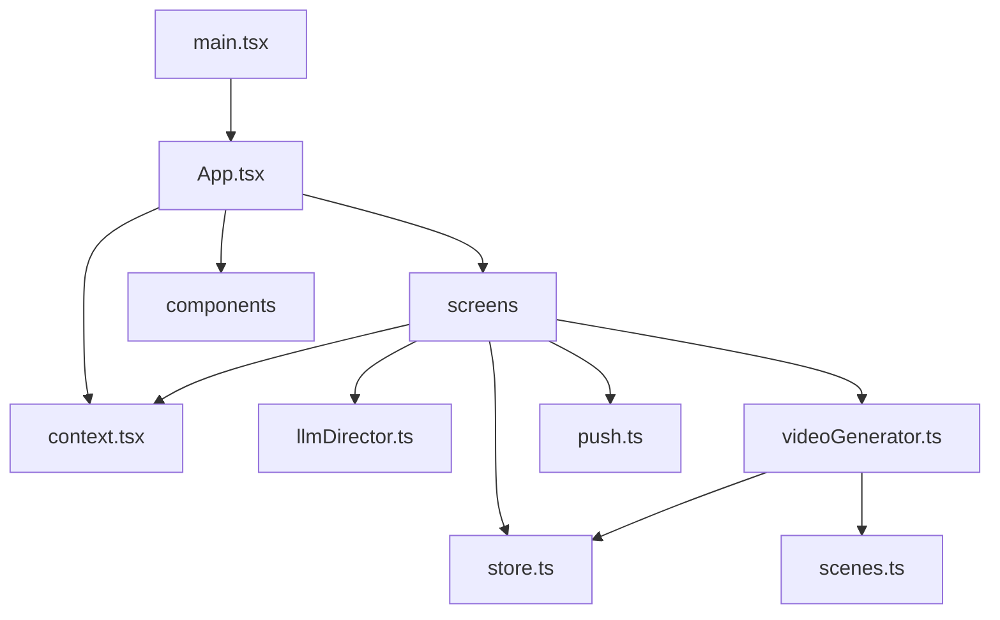

# Code Structure

## Build System

- **Type**: npm-compatible package managed by `package-lock.json`; verified locally with pnpm.
- **Application Root**: `myhour/`.
- **Build**: `tsc -b && vite build`.
- **Lint**: `oxlint`.
- **Deployment Base**: `/myhour/`.
- **Repository Shape**: The repository root is a Claude Design handoff bundle; the runnable application is nested under `myhour/`.

## Module Hierarchy

Text alternative: `main.tsx` mounts `App.tsx`. App composes screens, components, and shared context. Screens use storage, AI, generation, and push modules. The video generator uses scene drawing and storage.

## Existing Files Inventory

### Entry and Application State

- `myhour/src/main.tsx` - React bootstrap.
- `myhour/src/App.tsx` - Tab/modal routing and responsive desktop preview.
- `myhour/src/context.tsx` - Shared current-session and settings state.
- `myhour/src/store.ts` - Domain models, schedules, persistence, and archive retention.

### Feature Screens

- `myhour/src/screens/HomeScreen.tsx` - Current-day summary and wrapped-day view.
- `myhour/src/screens/TodayScreen.tsx` - Slot grid and record deletion.
- `myhour/src/screens/RecordScreen.tsx` - Text, photo, video, and WAV audio capture.
- `myhour/src/screens/WrapUpScreen.tsx` - AI direction, mood controls, generation, and archive.
- `myhour/src/screens/ArchiveScreen.tsx` - Archive browsing, playback, regeneration, download, and deletion.
- `myhour/src/screens/SettingsScreen.tsx` - Schedule, capture, push, backup, and API-key settings.

### Shared UI

- `myhour/src/components/IOSFrame.tsx` - Desktop iOS-device preview frame.
- `myhour/src/components/TabBar.tsx` - Primary navigation.
- `myhour/src/App.css` - App-level styling.
- `myhour/src/index.css` - Global reset and typography.

### Media and Integrations

- `myhour/src/scenes.ts` - Canvas scene primitives and visual composition.
- `myhour/src/videoGenerator.ts` - Media loading, audio mixing, timing, and recording.
- `myhour/src/llmDirector.ts` - Anthropic request and response normalization.
- `myhour/src/push.ts` - Push subscription client.
- `myhour/public/sw.js` - Service worker and notification handling.
- `myhour/push-server/worker.js` - Push delivery Worker.
- `myhour/push-server/roundtrip-test.mjs` - RFC 8291 encryption round-trip test.

### Test and Preview Utilities

- `myhour/src/genTest.ts` - Browser-based generation integration fixture.
- `myhour/src/preview.ts` - Canvas preview fixture.
- `myhour/gentest.html` - Generation test page.
- `myhour/preview.html` - Scene preview page.

### Configuration and Assets

- `myhour/package.json` and `myhour/package-lock.json` - Package metadata.
- `myhour/tsconfig*.json` - TypeScript projects.
- `myhour/vite.config.ts` - Vite base path and build version.
- `myhour/public/manifest.json` - PWA manifest.
- `myhour/public/bgm/` - Eighteen bundled MP3 tracks.
- `myhour/public/fonts/` - Diary font.
- `myhour/push-server/wrangler.toml` - Worker, KV, cron, and VAPID configuration.

## Design Patterns

### Context Facade

- **Location**: `context.tsx`.
- **Purpose**: Give screens a shared interface for current session and settings.
- **Implementation**: React Context with memoized actions.

### Local-First Repository Functions

- **Location**: `store.ts`.
- **Purpose**: Keep the app functional without accounts or a primary backend.
- **Implementation**: Functional localStorage and IndexedDB helpers.

### Strategy-by-Record-Type

- **Location**: `RecordScreen.tsx`, `videoGenerator.ts`, and `scenes.ts`.
- **Purpose**: Capture and render four media types.
- **Implementation**: Discriminated `RecordType` branches.

### Best-Effort Progressive Enhancement

- **Location**: Media decoding, fonts, AI, push, and service worker.
- **Purpose**: Continue with fallbacks when optional capabilities fail.
- **Implementation**: Feature detection, timeouts, warnings, and default direction.

## Critical Dependencies

- **React / React DOM 19** - Screen composition and state.
- **Vite 8** - Development and static production bundling.
- **TypeScript 6** - Static checking.
- **Oxlint** - JavaScript, TypeScript, React, and hooks linting.
- **Browser APIs** - MediaDevices, MediaRecorder, Canvas, Web Audio, IndexedDB, localStorage, PushManager, service workers.
- **Anthropic Messages API** - Optional narrative direction.
- **Cloudflare Workers and KV** - Push subscriptions and scheduled delivery.

