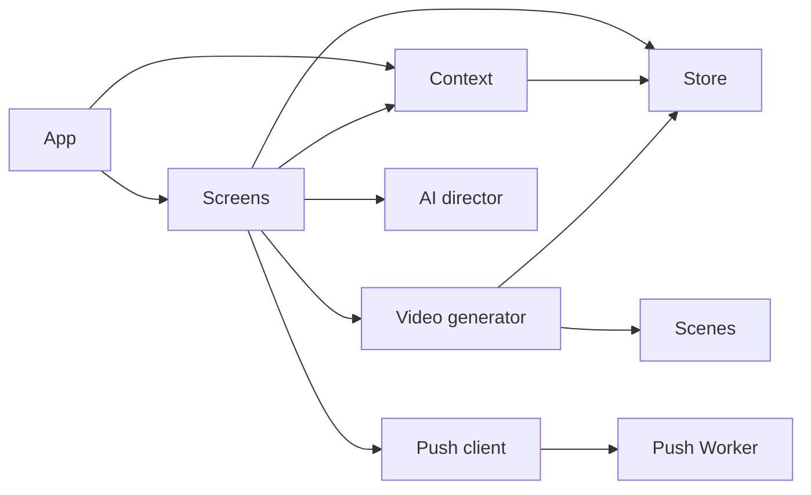

# Dependencies

## Internal Dependencies

Text alternative: App composes screens and context. Screens depend on context and store plus feature modules. The generator depends on store and scenes. The push client calls the push Worker.

## External Dependencies

### React

- **Version**: `^19.2.7`.
- **Purpose**: UI components, hooks, context, and rendering.
- **License**: MIT.

### Vite

- **Version**: `^8.1.0`.
- **Purpose**: Development server and production bundle.
- **License**: MIT.

### TypeScript

- **Version**: `~6.0.2`.
- **Purpose**: Static type checking.
- **License**: Apache-2.0.

### Oxlint

- **Version**: `^1.69.0`.
- **Purpose**: Static analysis.
- **License**: MIT.

### Playwright Core

- **Version**: `^1.61.1`.
- **Purpose**: Browser automation for preview/generation fixtures.
- **License**: Apache-2.0.

### Anthropic Messages API

- **Type**: Runtime external service.
- **Purpose**: Optional director metadata.
- **Risk**: User API credentials and journal text cross the network.

### Cloudflare Workers and KV

- **Type**: Runtime platform dependency.
- **Purpose**: Store subscriptions and send scheduled notifications.

### Bundled Media

- **Type**: Static runtime dependency.
- **Purpose**: BGM and handwriting font for recap generation.
- **Size**: Production output is approximately 88.2 MB, mostly eighteen MP3 files and a 3.2 MB font.

