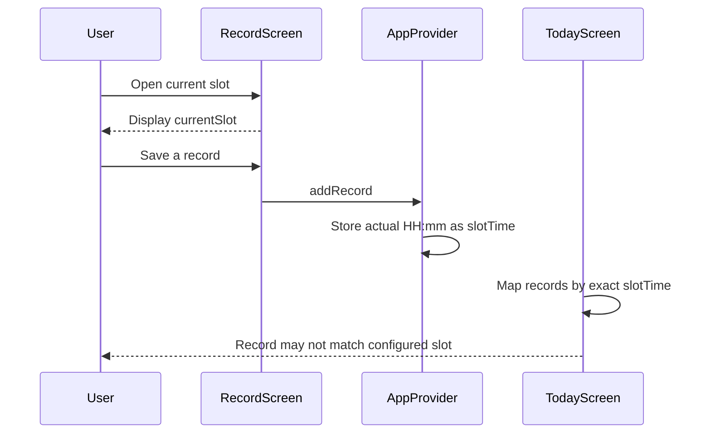
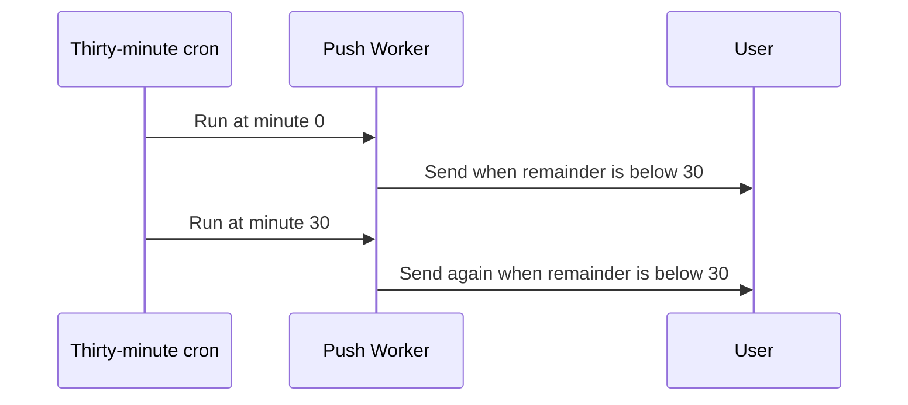
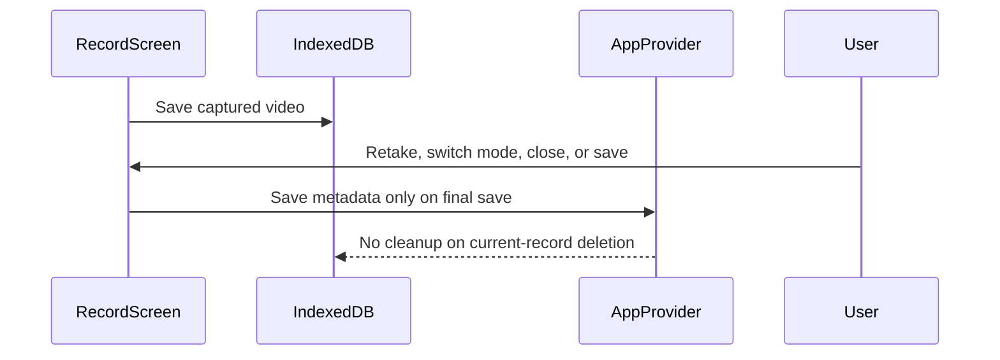

# Interaction Diagrams

## Record-to-Slot Interaction

Text alternative: RecordScreen displays the computed slot, but AppProvider stores the actual minute. TodayScreen performs an exact key lookup by configured slot, so a record captured between slot boundaries can disappear from the slot grid.

## Push Schedule Interaction

Text alternative: For intervals longer than 30 minutes, the current remainder condition accepts both the exact boundary and the following 30-minute cron run, which can produce duplicate reminders.

## Media Lifecycle Interaction

Text alternative: A captured video is written before the final record is saved. Retaking, switching mode, closing, or later deleting the record does not consistently delete the IndexedDB blob, so storage can accumulate orphaned media.

